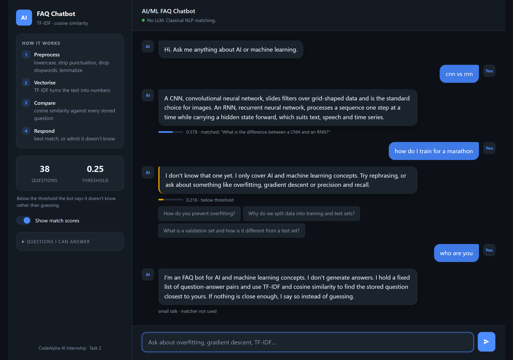

# CodeAlpha_FAQChatbot

**CodeAlpha Artificial Intelligence Internship — Task 2: Chatbot for FAQs**

An FAQ chatbot that answers questions about AI/ML concepts. You type a question in
your own words; the bot finds the closest matching question in its dataset of 38
question–answer pairs and replies with that answer.

It uses classical NLP — TF-IDF and cosine similarity — with **no LLM and no neural
network**. That is a deliberate choice, explained under [Why not deep
learning?](#why-not-deep-learning).



## How it works

The bot does not generate answers and does not understand English. It converts
sentences into lists of numbers and measures the angle between them.

```
"whats overfiting?"          ← what the user types (messy, typo, informal)
        |
        |  1. PREPROCESS
        v
["overfitting"]              ← lowercase, strip punctuation, drop stopwords,
                                lemmatize, fix typos
        |
        |  2. VECTORISE  (TF-IDF)
        v
[0.0, 0.81, 0.0, 0.12, ...]  ← one slot for every word the bot knows
        |
        |  3. COMPARE  (cosine similarity)
        v
Q4 scores 0.40  <-- highest  ← angle between the user's vector and every
Q8 scores 0.11                  stored question's vector
        |
        |  4. RESPOND
        v
"Overfitting is when a model memorises the training data..."
```

**1. Preprocess** (`preprocess.py`) — lowercase, strip punctuation, tokenize, drop
stopwords, lemmatize. `Overfitting`, `overfitting?` and `OVERFITTING` all collapse to
the same token. Lemmatizing is used over stemming because it produces real words
(`studies` → `study`, not `studi`), which makes intermediate output readable while
debugging.

**2. Vectorise** — TF-IDF weights each word by how often it appears in a question
(term frequency) and how rare it is across all questions (inverse document
frequency). Words like "model" and "what" appear everywhere and are automatically
pushed down; "backpropagation" appears once and is pushed up.

**3. Compare** — cosine similarity measures the *angle* between two vectors, not the
distance. This matters: "What is overfitting?" and "Could you please explain in
detail what overfitting actually means?" are very different lengths but point the
same direction, so they score as a close match. Distance-based matching gets this
wrong.

**4. Respond** — return the best match, or refuse (see below).

## Four details that do the real work

**A confidence threshold.** Ask an untuned bot "what is the weather in Mumbai?" and
it still computes a score for every question, picks the highest — maybe 0.09 — and
confidently explains gradient descent to someone who asked about rain. Below a
cosine score of **0.25** this bot says it does not know instead. Knowing when you
don't know is a property of a good system, not a nicety.

**Answers are indexed, not just questions.** Each FAQ is matched against its question
repeated three times plus its answer. "How do I stop my model memorising the training
data" shares no useful word with the question *"What is overfitting?"* but plenty with
its answer. Repeating the question keeps it in charge of the match while the answer
broadens what can be found.

**Greetings are an intent, not an FAQ.** "hi" is the first thing most people type,
and running it through the matcher produces a near-zero score and the "I don't know"
fallback — correct, and a terrible first impression. Greetings, thanks, goodbyes and
"what can you do" are handled by a small intent layer *before* the matcher. They are
not faked as entries in `faqs.json`, where they would pollute the vocabulary and skew
the IDF weights of every real question. The layer matches on the *entire* cleaned
input, so "hey" is a greeting while "hey what is overfitting" still reaches the
matcher and gets its answer.

**Typo correction that knows when to stay out of the way.** TF-IDF matches on exact
string equality, so "overfiting" scores zero against "overfitting". Unknown words are
snapped to the closest word the bot knows — but only if they are *not* in an English
dictionary. Without that guard, correcting purely by string distance rewrote real
words into FAQ vocabulary: "who won the cricket **match**" became "**batch**", which
matched the mini-batch gradient descent FAQ at 0.48 and defeated the threshold
entirely.

## Tuning

The question weight and confidence threshold were not guessed. A grid search over
both, scored against 24 cases — the 23 in `test_chatbot.py` plus the known limitation
below — picked weight 3 / threshold 0.25 as the best cell at 23/24:

| weight ↓ / threshold → | 0.20 | 0.25 | 0.30 | 0.35 | 0.40 |
|---|---|---|---|---|---|
| 1 | 21 | 19 | 19 | 15 | 14 |
| 2 | 22 | 22 | 21 | 18 | 17 |
| **3** | 21 | **23** | 21 | 21 | 21 |
| 4 | 22 | 22 | 22 | 21 | 21 |
| 6 | 21 | 22 | 22 | 22 | 21 |

Half the refusal test cases are deliberate near misses — "how do I train for a
marathon", "how much RAM do I need to train a model", "what is the learning curve for
a new language". Plainly off-topic questions score 0.000 and would be refused by any
threshold, so they prove nothing; the near misses are what actually pin the threshold
down.

## Known limitation

"Which university has the best machine learning course" is answered with *"What is
machine learning?"* at 0.62. No threshold fixes it — raising the bar past 0.62 would
refuse most genuine questions too.

The cause is fundamental to the approach: TF-IDF matches on shared words, so it can
tell what a question is *about* but not what it is *asking*. Topic and intent look
identical to it. Fixing this needs sentence embeddings, which model meaning rather
than word overlap. It is kept in `test_chatbot.py` under `KNOWN_LIMITATIONS`, printed
on every run rather than quietly deleted.

## Why not deep learning?

For matching against a fixed list of 38 questions, TF-IDF plus cosine similarity is
the correct tool: no training, no GPU, instant startup, and every decision it makes
can be inspected. A neural approach would be slower, harder to debug, and no more
accurate at this size. The scale at which that tradeoff flips is real, but this is
not it.

## Setup

```bash
git clone https://github.com/gajanand27-05/CodeAlpha_FAQChatbot.git
cd CodeAlpha_FAQChatbot

python -m venv venv
venv\Scripts\activate          # Windows
# source venv/bin/activate     # macOS / Linux

pip install -r requirements.txt
```

NLTK data (`stopwords`, `wordnet`, `words`) downloads automatically on first run.

## Usage

```bash
python app.py            # web chat interface, then open http://127.0.0.1:5000
python cli.py            # terminal version, type 'debug' to see match scores
python test_chatbot.py   # run the test suite
python preprocess.py     # watch the text cleaning step by step
```

## Project layout

| File | Purpose |
|---|---|
| `data/faqs.json` | The 38 question–answer pairs. Data is kept separate from logic so FAQs can be added without touching code |
| `preprocess.py` | Stage 1 — text cleaning, tokenizing, lemmatizing |
| `chatbot.py` | Stages 2–4 — vectorising, matching, confidence threshold. No UI code |
| `app.py` | Flask server — one page, one `/api/ask` JSON endpoint |
| `templates/`, `static/` | The chat interface: HTML, CSS and vanilla JavaScript |
| `cli.py` | Terminal interface |
| `test_chatbot.py` | Match, refusal and known-limitation cases |

## Tech stack

| Piece | Library | Why |
|---|---|---|
| Text preprocessing | NLTK | Ships the stopword list, lemmatizer and English dictionary ready to use |
| Vectorising + similarity | scikit-learn | `TfidfVectorizer` and `cosine_similarity`, two lines each and battle-tested |
| Web server | Flask | Serves one page and one JSON endpoint — nothing heavier is needed |
| Chat interface | HTML, CSS, vanilla JS | Full control over the interaction; no framework and no build step |

### A note on the interface

This started on Streamlit and was rewritten. Streamlit re-executes the entire
script on every interaction and rebuilds the page from that result, so the chat
visibly re-renders between messages and you cannot control the transitions.

The replacement is a Flask endpoint plus a small front end that keeps the
conversation in the browser and appends one element per message. Messages animate
in, a typing indicator covers the request, and the confidence bar fills from zero.
Only `transform` and `opacity` are animated — the browser composites those on the
GPU, whereas animating `height` or `margin` forces a layout recalculation on every
frame, which is what makes an interface feel heavy.

The trade is roughly 300 lines of CSS and JavaScript against a UI that behaves
exactly as intended. `chatbot.py` did not change by a single line — the matching
logic never knew what the interface was, which is precisely why the swap was cheap.

## Author

Built by **gajanand27-05** as part of the CodeAlpha AI Internship.
